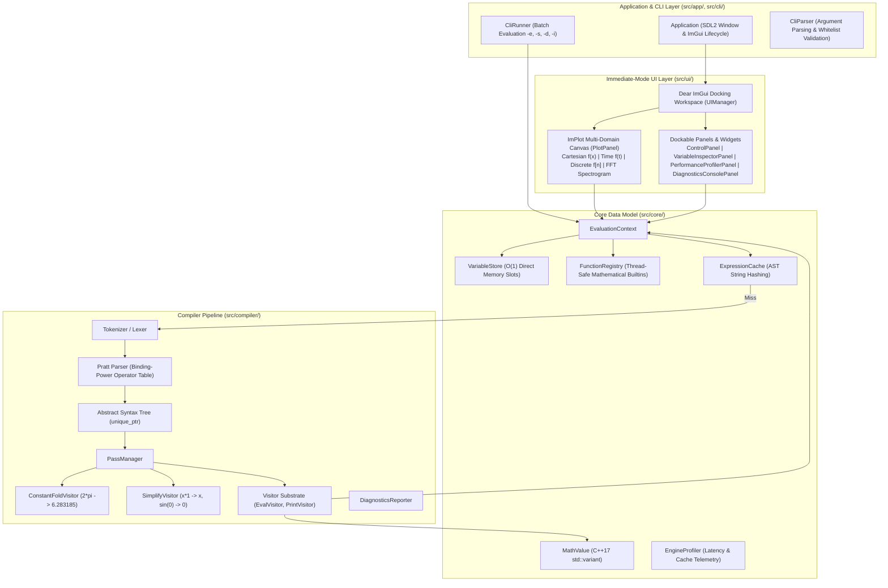
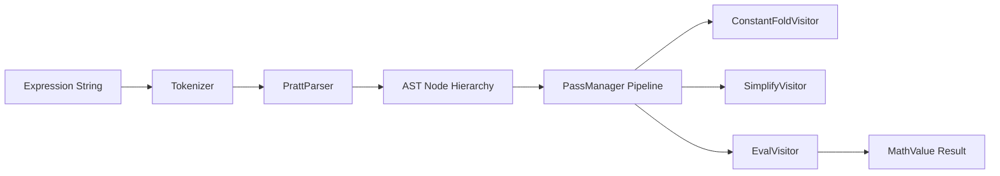

# MathStudio Master Architecture

> **Current Architecture: v0.3.0**  
> MathStudio is a high-performance scientific computing and interactive mathematical visualization engine built in C++17.

---

## 1. Architectural Overview & System Layers

MathStudio is organized into distinct layers where the math compiler, core engine, immediate-mode GUI, and CLI operate independently:



---

## 2. Compiler Pipeline (`src/compiler/`)

Expressions are compiled into an Abstract Syntax Tree using a Pratt Parser and evaluated via AST visitor passes:



### Implemented Compiler Components
- **Pratt Parser (`src/compiler/parser/PrattParser.hpp`)**: Precedence and associativity parsing via binding-power lookup tables.
- **AST Nodes (`src/compiler/ast/Node.hpp`)**: Memory-efficient nodes with 1-byte opcode enums (`BinaryOpType`, `UnaryOpType`).
- **Pass Manager (`src/compiler/passes/PassManager.hpp`)**:
  - `ConstantFoldVisitor`: Parse-time constant evaluation (e.g. `2*pi` $\rightarrow$ `6.283185`).
  - `SimplifyVisitor`: Algebraic identity reduction (`x+0` $\rightarrow$ `x`, `x*1` $\rightarrow$ `x`, `x*0` $\rightarrow$ `0`, `sin(0)` $\rightarrow$ `0`, `cos(0)` $\rightarrow$ `1`).
- **Evaluation Visitor (`src/compiler/visitors/EvalVisitor.hpp`)**: AST tree walker returning C++17 `MathValue`.
- **Diagnostics (`src/compiler/diagnostics/Diagnostics.hpp`)**: Error location, source ranges, and formatting.

---

## 3. Core Engine Layer (`src/core/`)

- **`MathValue`**: C++17 `std::variant<double, std::complex<double>, Matrix, Vector, bool>` providing type safety and algebraic operations.
- **`VariableStore`**: Direct $O(1)$ indexed memory slots for high-frequency variables (`x`, `t`, `n`, `theta`, `z`, `ans`), eliminating string hash map overhead.
- **`FunctionRegistry`**: Mathematical function dispatch with domain validation.
- **`ExpressionCache`**: Thread-safe AST cache indexed by expression string key.
- **`EngineProfiler`**: Real-time telemetry tracking parse latency, evaluation rate, and cache hit ratio.

---

## 4. Immediate-Mode UI Architecture (`src/ui/`)

- **`UIManager`**: Docking manager coordinating the Dear ImGui docking space and panel layout.
- **`PlotPanel`**: ImPlot multi-domain canvas managing:
  - **Cartesian $f(x)$**: Multi-curve continuous function plotting.
  - **Time Domain $f(t)$**: Signal waveform plotting.
  - **Discrete Series $f[n]$**: Discrete stem sequence plotting.
  - **FFT Spectrogram**: Real-time Power Spectral Density $|X(f)|^2$ analyzer.
  - **Zero-Allocation Plot Buffers**: Pre-allocated static 600-point arrays for 60+ FPS rendering without frame-by-frame heap allocations.
  - **Derivative Overlay `[D]`**: Toggleable real-time derivative curves ($y = f'(x)$, signal velocity $\frac{df}{dt}$, discrete difference $\Delta f[n]$).
- **`VariableInspectorPanel`**: Parameter sliders with Play ▶ / Pause ⏸ animation controls and `--var` CLI synchronization.
- **`PerformanceProfilerPanel`**: Real-time parse latency, evaluation rate, cache hit ratio, and RAM meters.
- **`DiagnosticsConsolePanel`**: Live token and parse error reporting.

---

## 5. Application & CLI Layer (`src/app/`, `src/cli/`)

- **`Application` (`src/app/Application.hpp`)**: SDL2 window creation, Windows DWM dark titlebar integration, ImGui/ImPlot context setup, and main rendering loop.
- **`CliParser` (`src/cli/CliParser.hpp`)**: Parses command line arguments (`-e`, `-s`, `-d`, `-i`, `--var`, `--check-leaks`, `--benchmark`).
- **`CliRunner` (`src/cli/CliRunner.hpp`)**: Headless batch execution for mathematical evaluation, root solving, intersection finding, and CRT memory leak audits.

---

## 6. Historical Architecture Deprecation

```
Legacy Architecture (v0.0.1 – v0.1.x) [DEPRECATED & FROZEN IN legacy/]
  Shunting-Yard Parser ──► Postfix RPN Vector ──► Postfix Stack Evaluator
  (Preserved exclusively in legacy/shunting_yard.cpp for historical benchmark regression testing)

Current Architecture (v0.2.0 – v0.3.0) [BUILT & VERIFIED]
  Pratt Parser ──► AST Nodes ──► PassManager (ConstantFold + Simplify) ──► EvalVisitor ──► MathValue
  + Dear ImGui Docking UI & ImPlot Multi-Domain Canvas
  + Zero-Allocation 600-Point Plot Buffers
  + MSVC CRT / Valgrind Memory Leak Audit (--check-leaks)
```
