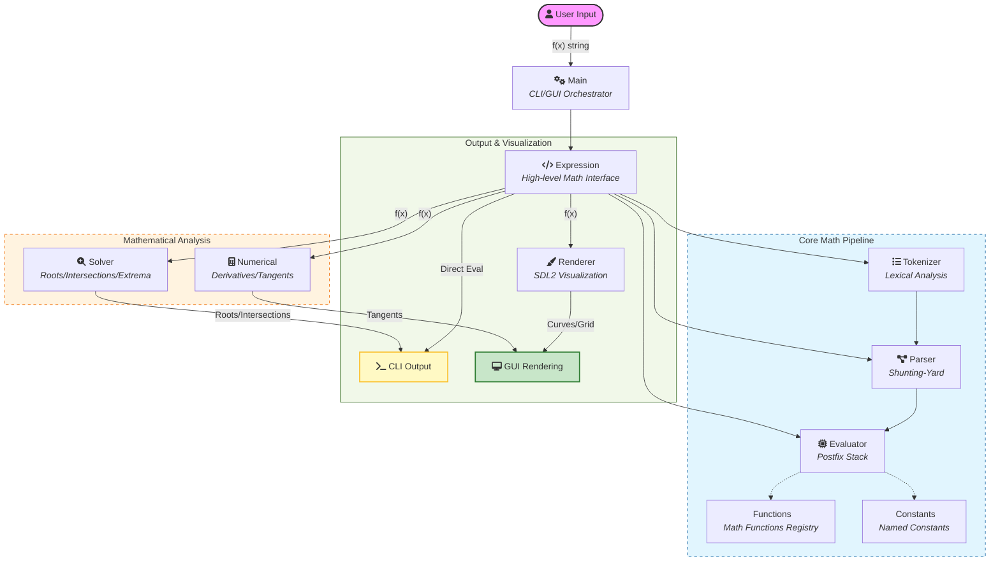

<p align="center">
  <h1 align="center">Function Plotter</h1>
  <p align="center">
    A real-time mathematical function plotter with an interactive GUI and a powerful CLI.<br>
    Built from scratch in C++17 with SDL2. No external math libraries.
  </p>
</p>

<p align="center">
  
  
  
  
  
  <br>
  
  <a href="https://github.com/Bharat940/Simple-math-calculator-and-plotter/releases/tag/v0.0.1">
    
  </a>
</p>

---

## Features

### Interactive GUI
- **Real-time function plotting** with adaptive curve rendering for smooth visuals
- **Multi-function support** -- plot and compare multiple functions simultaneously with color-coded legends
- **Zoom and pan** -- mouse wheel zoom with keyboard panning (arrow keys)
- **Tangent line visualization** at the cursor position
- **Root and extrema markers** -- toggle display of zeros and local min/max points
- **Live coordinate tracking** -- see exact (x, y) values at the mouse cursor
- **Adaptive grid** with configurable scaling modes (auto / fixed / loose / dense)
- **Discontinuity detection** -- avoids drawing false connections at asymptotes (e.g. `tan(x)`)

### Command-Line Interface
- **Evaluate** expressions: `plotter -e "sin(pi/2)"`
- **Solve** equations (find roots): `plotter -s "x^2 - 4"`
- **Find intersections** of two functions: `plotter -i "x^2" "2*x + 1"`
- **Verbose mode** with Newton-Raphson convergence details

---

## Supported Math

| Category | Functions |
|----------|-----------|
| **Trigonometric** | `sin`, `cos`, `tan`, `asin`, `acos`, `atan` |
| **Hyperbolic** | `sinh`, `cosh`, `tanh` |
| **Exponential** | `exp`, `log` (natural), `log10`, `log(x, base)` |
| **Algebraic** | `sqrt`, `abs`, `floor`, `ceil`, `pow`, `max`, `min` |
| **Constants** | `pi`, `e` (Euler's number), `phi` (Golden ratio) |
| **Operators** | `+`, `-`, `*`, `/`, `^` (power) |

**Smart parsing features:**
- Implicit multiplication: `2x`, `3sin(x)`, `(x+1)(x-1)`
- Unary minus: `-x^2`, `sin(-x)`
- Nested functions: `sin(cos(x^2))`

---

## Building from Source

### Prerequisites

- **CMake** 3.10 or later
- **C++17** compatible compiler (GCC 7+, Clang 5+, MSVC 2017+)
- **SDL2** and **SDL2_ttf** development libraries

### Linux

```bash
# Install dependencies (Ubuntu / Debian)
sudo apt-get install cmake g++ libsdl2-dev libsdl2-ttf-dev

# Build
git clone https://github.com/Bharat940/Simple-math-calculator-and-plotter.git
cd Simple-math-calculator-and-plotter
mkdir build && cd build
cmake ..
make

./plotter "sin(x)"
```

### macOS

```bash
# Install dependencies via Homebrew
brew install cmake sdl2 sdl2_ttf

# Build
git clone https://github.com/Bharat940/Simple-math-calculator-and-plotter.git
cd Simple-math-calculator-and-plotter
mkdir build && cd build
cmake ..
make

./plotter "sin(x)"
```

### Windows

**Recommended: vcpkg + Visual Studio 2022**

1. **Install Dependencies via vcpkg**:
   ```powershell
   vcpkg install sdl2 sdl2-ttf --triplet x64-windows
   ```

2. **Build the Project**:
   ```powershell
   # From the project root
   # Note: Replace C:/vcpkg/ with your actual vcpkg installation path if different
   cmake -B build -G "Visual Studio 17 2022" -DCMAKE_TOOLCHAIN_FILE=C:/vcpkg/scripts/buildsystems/vcpkg.cmake
   cmake --build build --config Release
   ```

3. **Run**:
   ```powershell
   .\build\Release\plotter.exe "sin(x)"
   ```

---

## Usage

### GUI Mode

```bash
# Windows
.\build\Release\plotter.exe "x^3 - 3*x"

# Linux / macOS
./build/plotter "sin(x), cos(x), tan(x)"
```

### CLI Mode

```bash
# Evaluate at x = 0
.\build\Release\plotter.exe -e "sin(pi/2)"
# Output: 1

# Find roots of f(x) = 0
.\build\Release\plotter.exe -s "x^2 - 4"
# Output: -2 2

# Detailed solver output
./build/plotter -s "x^3 - x" --verbose

# Find intersections of f(x) = g(x)
.\build\Release\plotter.exe -i "x^2" "2*x + 1"
# Output: -0.414214 2.414214
```

### All Options

| Option | Description | Default |
|--------|-------------|---------|
| `--range xmin xmax` | Set solving/plotting range | -100 to 100 |
| `--step value` | Solver step size | 0.1 |
| `--precision value` | Numeric precision | 1e-6 |
| `--zoom-step value` | Zoom sensitivity | 1.1 |
| `--zoom-min value` | Minimum view range | 0.01 |
| `--zoom-max value` | Maximum view range | 500 |
| `--scale mode` | Grid scaling: `auto` / `fixed` / `loose` / `dense` | auto |
| `--font path` | Custom font file path | System default |
| `--verbose` | Detailed solver output | off |

---

## GUI Controls

| Key | Action |
|-----|--------|
| Mouse Wheel | Zoom in / out |
| Arrow Keys | Pan the viewport |
| T | Toggle tangent line at cursor |
| G | Toggle grid |
| R | Toggle roots (zeros) display |
| E | Toggle extrema (min/max) display |
| Tab | Cycle through active function |
| ESC | Quit |

---

## Architecture

The project follows a modular pipeline design:



### Module Breakdown

| Module | File(s) | Description |
|--------|---------|-------------|
| **Main** | `main.cpp` | Entry point: CLI argument parsing, mode dispatch (-e/-s/-i/GUI), SDL2 GUI event loop |
| **Expression** | `expression.h/cpp` | High-level math expression interface: tokenizes, parses, validates, and evaluates expressions |
| **Tokenizer** | `tokenizer.h/cpp` | Lexical analysis: converts expression strings to tokens with implicit multiplication support |
| **Parser** | `parser.h/cpp` | Shunting-Yard algorithm: converts infix token stream to postfix notation |
| **Evaluator** | `evaluator.h/cpp` | Stack-based postfix evaluation engine with function and constant lookups |
| **Functions** | `functions.h/cpp` | Registry of 18 built-in math functions (sin, cos, log, etc.) with domain validation |
| **Constants** | `constants_registry.h/cpp` | Named constant registry (pi, e, phi) for symbolic math |
| **Solver** | `solver.h/cpp` | Root-finding algorithms: bisection + Newton-Raphson for equations, intersections, extrema |
| **Numerical** | `numerical.h/cpp` | Numerical differentiation using central differences and tangent line computation |
| **Renderer** | `renderer.h/cpp` | SDL2 rendering engine: adaptive curve plotting, grid, axes, labels, legend, markers |

### Key Algorithms

- **Adaptive Curve Rendering**: Recursive subdivision based on screen-space error. Produces smooth curves with fewer samples where the function is linear, and more detail at curves and inflection points.
- **Discontinuity Detection**: Slope-threshold check to avoid connecting asymptotes (e.g., `tan(x)` near pi/2).
- **Hybrid Root Finding**: Bisection method for robustness, followed by Newton-Raphson for precision refinement.
- **Nice Number Grid Scaling**: Grid lines snap to "nice" intervals (1, 2, 5 x 10^n) for readable axis labels.

---

## Project Structure

```
Simple-math-calculator-and-plotter/
|-- CMakeLists.txt              # Cross-platform build configuration
|-- LICENSE                     # MIT License
|-- README.md
|-- .gitignore
|-- .github/
|   +-- workflows/
|       +-- build.yml           # CI/CD -- build and test on Linux, macOS, Windows
|-- tests/
|   +-- test_math.cpp           # Unit tests for the math pipeline
+-- src/
    |-- main.cpp                # Entry point, CLI parsing, GUI event loop
    |-- renderer.h/cpp          # SDL2 rendering engine
    +-- math/
        |-- tokenizer.h/cpp             # Lexical analysis
        |-- parser.h/cpp                # Shunting-Yard parser
        |-- evaluator.h/cpp             # Postfix evaluator
        |-- expression.h/cpp            # Expression wrapper
        |-- functions.h/cpp             # Function registry
        |-- solver.h/cpp                # Root and intersection finding
        |-- numerical.h/cpp             # Derivatives and tangents
        |-- constants.h                 # Numeric epsilon constants
        |-- constants_registry.h/cpp    # Named constants (pi, e, phi)
        |-- result.h                    # EvalResult type
        +-- geometry.h                  # Line struct (slope + intercept)
```

---

## Examples

```bash
# Polynomial curves
./plotter "x^2, x^3, x^4"

# Trigonometric comparison
./plotter "sin(x), cos(x)"

# Damped oscillation
./plotter "exp(-x^2) * sin(10*x)"

# Gaussian curve
./plotter "exp(-x^2)"

# Combined expression
./plotter "sin(x^2) + cos(x^3)"

# Root finding with details
./plotter -s "x^3 - 6*x^2 + 11*x - 6" --verbose
```

---

## Testing

The project includes a self-contained unit test suite (no external test framework required).
Tests cover the full math pipeline: tokenizer, parser, evaluator, functions, constants,
numerical differentiation, root-finding, and edge cases.

```bash
# Build and run tests
mkdir build && cd build
cmake ..
cmake --build .

# Linux / macOS
./tests

# Windows
.\build\Release\tests.exe
```

### What is tested

| Suite | Coverage |
|-------|----------|
| Tokenizer | Number/variable/operator/function/constant tokens, implicit multiplication, invalid characters, malformed numbers |
| Parser | Postfix conversion, operator precedence, associativity, parentheses, unary minus, mismatched parens |
| Evaluator | Arithmetic, variable substitution, division by zero, order of operations |
| Functions | All 18 built-in functions, domain error detection (asin, sqrt, log), binary functions (pow, max, min, log with base) |
| Constants | pi, e, phi values, usage in expressions |
| Expression | Complex expressions, sin^2+cos^2 identity, nested functions, evalSafe |
| Numerical | Derivatives of x^2, sin(x), x^3 at specific points, tangent line computation |
| Solver | Root-finding (x^2-4, sin(x), x^3), detailed results, intersections, extrema |
| Edge Cases | Empty expressions, large exponents, negative exponents, deep nesting |

---

## Technical Highlights

- **Zero external math dependencies** -- all parsing, evaluation, and numerical methods implemented from scratch
- **Cross-platform** -- builds and runs on Linux, macOS, and Windows with a single CMakeLists.txt
- **CI/CD** -- automated build and test on three platforms via GitHub Actions
- **Unit tested** -- comprehensive test suite covering all math modules with 119 passing tests
- **Safe evaluation** — `EvalResult` pattern provides structured error handling without exceptions in hot paths
- **Domain-aware functions** — `sqrt`, `log`, `asin`, `acos`, and `tan` return clear error messages for out-of-domain inputs
- **Cross-platform font loading** — automatic fallback chain across Linux, macOS, and Windows font paths
- **Input validation** — character whitelisting, parenthesis balancing, and nesting depth limits

---

## Download & Releases

The latest compiled binaries for Windows, Linux, and macOS are available in the [Releases](https://github.com/Bharat940/Simple-math-calculator-and-plotter/releases/tag/v0.0.1) section.

---

## Contributing

Contributions are welcome! Whether you're fixing a bug, suggesting a feature, or improving documentation, here's how you can help:

1.  **Fork** the repository.
2.  Create a **feature branch** (`git checkout -b feature/AmazingFeature`).
3.  **Commit** your changes (`git commit -m 'Add AmazingFeature'`).
4.  **Push** to the branch (`git push origin feature/AmazingFeature`).
5.  Open a **Pull Request**.

---

## License

This project is licensed under the [MIT License](LICENSE).

---

## Author

**Bharat Dangi**  
📧 [bdangi450@gmail.com](mailto:bdangi450@gmail.com)  
🔗 [github.com/Bharat940](https://github.com/Bharat940)