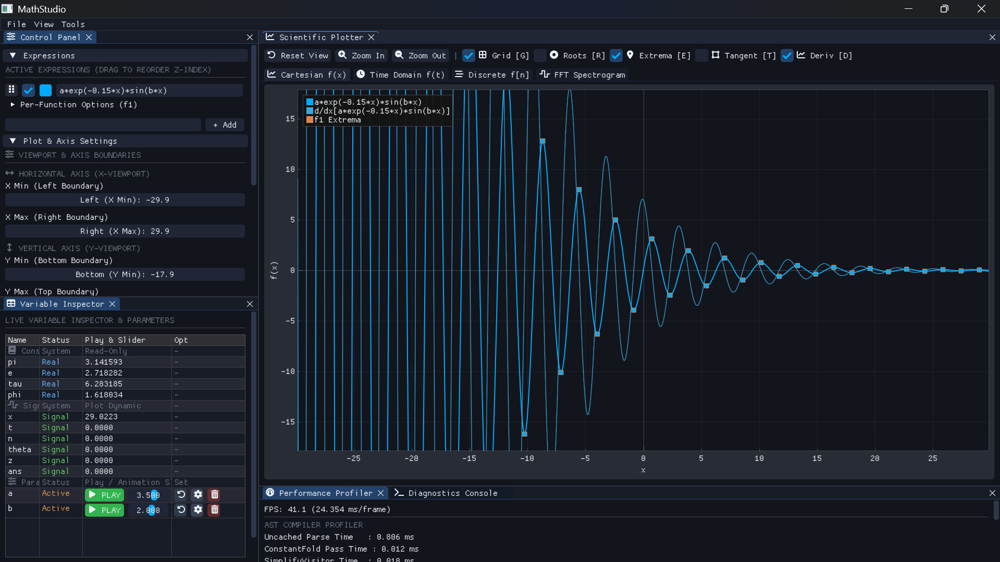
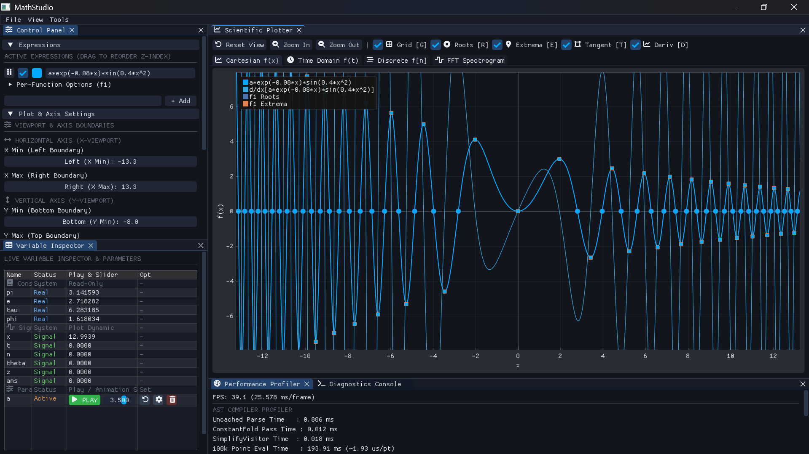
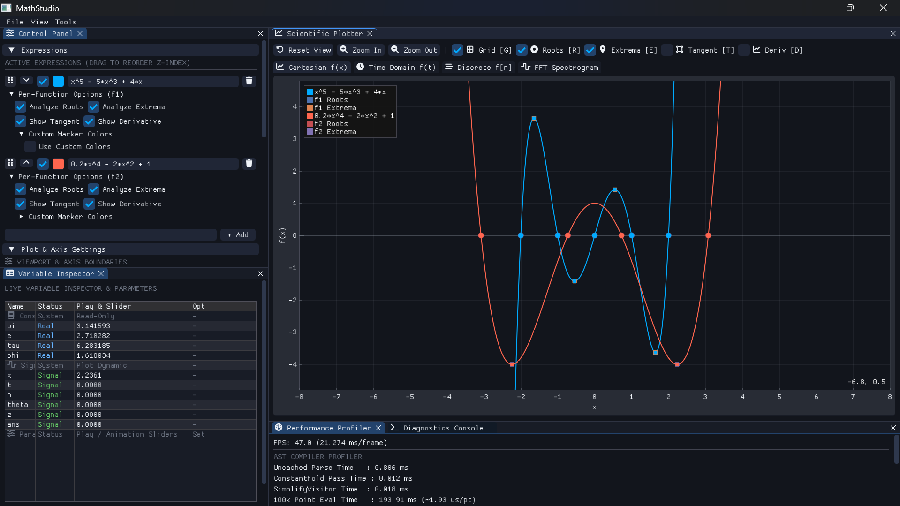
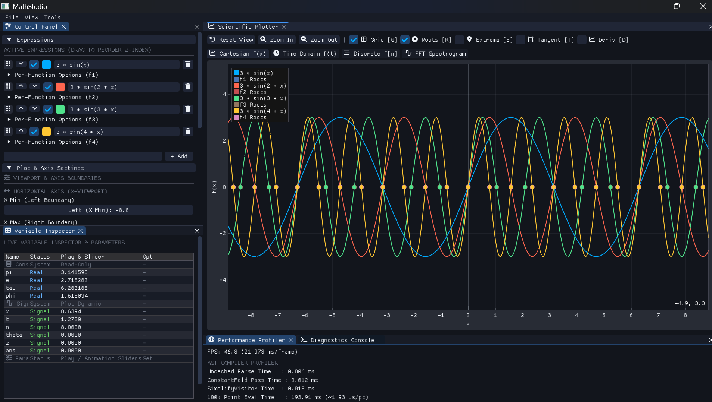
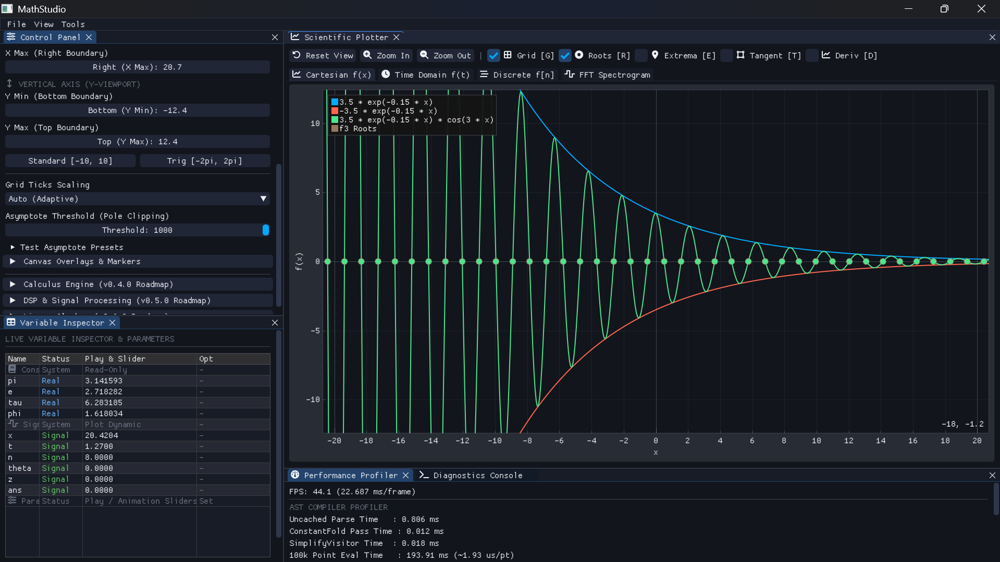
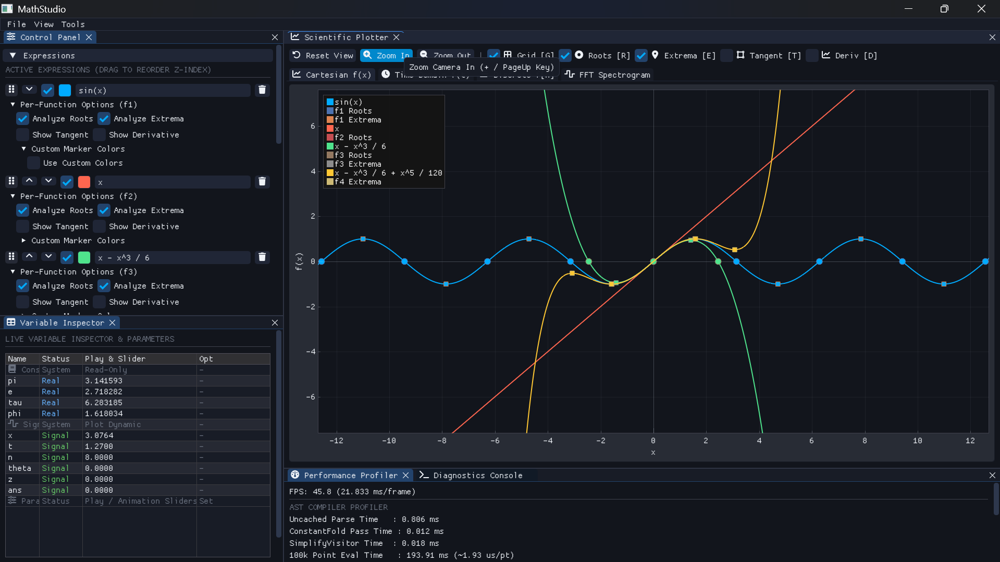

<p align="center">
  <h1 align="center">MathStudio</h1>
  <p align="center">
    A real-time mathematical function plotter with an interactive GUI and a powerful CLI.<br>
    Built from scratch in C++17 with SDL2 and an extensible AST compiler engine. No external math libraries.
  </p>
</p>

<p align="center">
  
  
  
  
  
  <br>
  
  <a href="https://github.com/Bharat940/Simple-math-calculator-and-plotter/releases/tag/v0.3.0">
    
  </a>

  
  
</p>

---

## Features

### Dear ImGui & ImPlot UI Architecture (v0.3.0 Release)
- **Dockable Window Layout**: Customizable, fixed-position docking workspace (`Scientific Plotter`, `Control Panel`, `Variable Inspector`, `Performance Profiler`, `Diagnostics Console`).
- **FontAwesome 6 Vector Icons**: Crisp vector iconography integrated across all UI buttons, tabs, and status badges.
- **Multi-Domain Canvas Tabs**:
  - **Cartesian $f(x)$**: Continuous real-axis function grapher.
  - **Time Domain $f(t)$**: Signal waveform plotter ($t \in [t_{min}, t_{max}]$).
  - **Discrete Series $f[n]$**: Discrete stem plot series ($n \in \mathbb{Z}$).
  - **FFT Spectrogram**: Real-time Power Spectral Density $|X(f)|^2$ analyzer.
- **Interactive Variable Inspector**:
  - Live parameter sliders with smooth Play ▶ / Pause ⏸ animation controls.
  - Initial value preservation for CLI `--var a=2.5 --var b=1.5` flags.
  - Smart typing protection (filters partial function name prefixes like `co`, `sq` while typing).
  - Auto-pruning garbage collector for unreferenced parameters and dedicated Trash `🗑` Delete buttons.
- **Real-Time Derivative Curve Overlay `[D]`**:
  - Press key **`D`** or check **`Deriv [D]`** to render real-time derivative curves $y = f'(x)$, signal velocity $\frac{df}{dt}$, and discrete difference $\Delta f[n]$ with matching color family shading.
- **Memory Leak & Diagnostic Audit Mode (`--check-leaks`)**:
  - Command-line flag `--check-leaks` running MSVC CRT memory heap audits (`_CrtDumpMemoryLeaks`) and live process RAM (MB) meter verifying **0 memory leaks**.
- **Zero-Allocation Render Loop**:
  - Pre-allocated static sample vectors for 600 plot points per frame, eliminating heap allocations during graph plotting.

### Compiler-Driven AST Engine (v0.2.0 Architecture)
- **Pratt Parser Frontend**: Binding-power operator table parser (`infixBindingPower`, `prefixBindingPower`). Handles operator precedence and associativity with precision.
- **Compiler Pass Manager Pipeline**:
  - `ConstantFoldVisitor`: Parse-time folding of constant expressions (e.g. `2*pi → 6.283185`).
  - `SimplifyVisitor`: Parse-time algebraic identity reduction (`x+0 → x`, `x*1 → x`, `x*0 → 0`, `pow(x,1) → x`, `sin(0) → 0`, `cos(0) → 1`, `-(-x) → x`).
- **C++17 `MathValue` Variant Substrate**: Powered by `std::variant<double, std::complex<double>, Matrix, Vector, bool>` for type-safe compile-time operations and complex number support.
- **$O(1)$ Direct Variable Slots**: `VariableStore` maintains direct memory slots (`xVal`, `tVal`, `nVal`, `thetaVal`, `zVal`, `ansVal`) bypassing string hash map lookups.
- **Compact Enum Opcodes**: Nodes use 1-byte `BinaryOpType` and `UnaryOpType` enums, eliminating 32-byte string overhead per operator node.
- **AST Expression Caching**: `ExpressionCache` caches AST trees by string key, eliminating re-parsing overhead across render frames (`0.00 ms` re-parse cost).

### Interactive GUI
- **Real-time function plotting** with adaptive curve rendering for smooth visuals
- **Multi-function support** -- plot and compare multiple functions simultaneously with color-coded legends and a curated dark palette
- **Zoom and pan** -- mouse wheel zoom with keyboard panning (arrow keys)
- **Tangent line visualization** at the cursor position
- **Root and extrema markers with live coordinate text labels** -- toggle display of zeros, local min (yellow), local max (orange), and saddle points (gray) with `x=...` and `(x, y)` text callouts directly on canvas
- **Live coordinate tracking** -- see exact (x, y) values at the mouse cursor
- **Adaptive grid** with configurable scaling modes (auto / fixed / loose / dense)
- **Discontinuity detection** -- avoids drawing false connections at asymptotes (e.g. `tan(x)`), configurable via `--disc-threshold`
- **Resizable window** -- default `1280x720` resolution with full dynamic window scaling

### Command-Line Interface & Signal Math
- **Evaluate** expressions: `mathstudio -e "sin(tau/4)"`
- **Scientific Notation**: parsing for tiny or huge numbers directly (`1e-5`, `2.3e10`, `3E2`)
- **Signal Variables**: native support for `x` (standard), `t` (time domain for DSP/signals, e.g. `sin(2*pi*t)`), `n` (discrete sequence index), `theta`, and `z`
- **Solve** equations (find roots): `mathstudio -s "x^2 - 4"`
- **Find intersections** of two functions: `mathstudio -i "x^2" "2*x + 1"`
- **Verbose mode** with Newton-Raphson convergence details

---

## Supported Math

| Category | Functions / Symbols |
|----------|---------------------|
| **Trigonometric** | `sin`, `cos`, `tan`, `asin`, `acos`, `atan` |
| **Hyperbolic** | `sinh`, `cosh`, `tanh` |
| **Exponential** | `exp`, `log` (natural), `log10`, `log(x, base)` |
| **Algebraic** | `sqrt`, `abs`, `floor`, `ceil`, `pow`, `max`, `min` |
| **Variables** | `x` (standard), `t` (time domain), `n` (discrete index), `theta`, `z` |
| **Constants** | `pi`, `e` (Euler's number), `phi` (Golden ratio), `tau` (`= 2*pi`) |
| **Operators** | `+`, `-`, `*`, `/`, `^` (power) |

**Smart compiler features:**
- Implicit multiplication: `2x`, `3sin(x)`, `(x+1)(x-1)`, `2pi`, `2(3+4)`
- Scientific notation: `1.5e-3`, `2.3e10`, `3E2`
- Unary minus & double negation: `-x^2`, `sin(-x)`, `--5`
- Nested function calls: `sin(cos(x^2))`, `max(max(1,2),3)`

---

## Building from Source

### Prerequisites

- **CMake** 3.10 or later
- **C++17** compatible compiler (GCC 7+, Clang 5+, MSVC 2017+)
- **SDL2** and **SDL2_ttf** development libraries

### Linux

```bash
# Install dependencies (Ubuntu / Debian)
sudo apt-get install cmake g++ libsdl2-dev libsdl2-ttf-dev

# Build
git clone https://github.com/Bharat940/Simple-math-calculator-and-plotter.git
cd Simple-math-calculator-and-plotter
mkdir build && cd build
cmake -DCMAKE_BUILD_TYPE=Release ..
make

./mathstudio "sin(x)"
```

### macOS

```bash
# Install dependencies via Homebrew
brew install cmake sdl2 sdl2_ttf

# Build
git clone https://github.com/Bharat940/Simple-math-calculator-and-plotter.git
cd Simple-math-calculator-and-plotter
mkdir build && cd build
cmake -DCMAKE_BUILD_TYPE=Release ..
make

./mathstudio "sin(x)"
```

### Windows

#### Option A: Interactive GUI Plotter (Visual Studio MSVC + vcpkg)
```powershell
# 1. Install dependencies via vcpkg
vcpkg install sdl2 sdl2-ttf --triplet x64-windows

# 2. Load Visual Studio environment & build with CMake
& "C:\Program Files\Microsoft Visual Studio\18\Community\Common7\Tools\Launch-VsDevShell.ps1" -Arch amd64
cmake -B build -DCMAKE_BUILD_TYPE=Release -DCMAKE_TOOLCHAIN_FILE="C:/Dev/vcpkg/scripts/buildsystems/vcpkg.cmake"
cmake --build build --config Release

# 3. Launch Interactive GUI Window
.\build\mathstudio.exe "sin(x), cos(x)"
```

#### Option B: Fast CLI Engine (MinGW GCC)
Builds `mathstudio.exe` in CLI evaluation & solver mode directly from any PowerShell prompt:

```powershell
cmake -B build -G "MinGW Makefiles" -DCMAKE_BUILD_TYPE=Release
cmake --build build

.\build\tests.exe
.\build\mathstudio.exe -e "sin(tau/4)"
```

---

---

## User Interface & Media Gallery

### GitHub Pages Website & Video Demo
🌐 **Interactive Web Landing Page**: [https://bharat940.github.io/Simple-math-calculator-and-plotter/](https://bharat940.github.io/Simple-math-calculator-and-plotter/)

MathStudio includes a full MP4 screen recording demo ([`docs/screenshots/mathstudio_v030_demo.mp4`](docs/screenshots/mathstudio_v030_demo.mp4)) and an extensive high-resolution screenshot gallery showcasing multi-domain charting, live parameter controls, and real-time derivative overlays:

<p align="center">
  
  
</p>
<p align="center">
  
  
</p>
<p align="center">
  
  
</p>

### Classified Screenshot Index (`docs/screenshots/`)

| Screenshot File | Description & Mathematical Content |
| :--- | :--- |
| **[`01_damped_harmonic_wave.png`](docs/screenshots/01_damped_harmonic_wave.png)** | Exponential decay envelope (`a*exp(-0.15*x)*sin(b*x)`) with derivative overlay `[D]` and extrema `[E]`. |
| **[`02_discrete_series_stem_plot.png`](docs/screenshots/02_discrete_series_stem_plot.png)** | Discrete stem plot series (`0.8^n * sin(n*pi/4)`) with integer sample index pins $n \in \mathbb{Z}$. |
| **[`03_quadratic_chirp_wave.png`](docs/screenshots/03_quadratic_chirp_wave.png)** | Quadratic radar chirp wave (`a*exp(-0.08*x)*sin(0.4*x^2)`) showing zero aliasing at high frequencies. |
| **[`04_normalized_sinc_function.png`](docs/screenshots/04_normalized_sinc_function.png)** | Normalized `sinc(x)` function (`a*sin(b*x)/(b*x)`) with main lobe peak and decaying side lobes. |
| **[`05_quantum_wave_packet_tangent.png`](docs/screenshots/05_quantum_wave_packet_tangent.png)** | Quantum Gaussian wave packet with mouse tangent line `[T]` and cursor coordinate callout. |
| **[`06_quintic_quartic_intersections.png`](docs/screenshots/06_quintic_quartic_intersections.png)** | Simultaneous quintic polynomial (`x^5 - 5*x^3 + 4*x`) and quartic polynomial (`0.2*x^4 - 2*x^2 + 1`). |
| **[`07_harmonic_resonance_spectrum.png`](docs/screenshots/07_harmonic_resonance_spectrum.png)** | 4 overlaid harmonic sine waves ($f, 2f, 3f, 4f$) with color-coded legends and zero-crossing roots `[R]`. |
| **[`08_damped_oscillator_exponential_envelope.png`](docs/screenshots/08_damped_oscillator_exponential_envelope.png)** | Exponential envelope pair ($\pm A e^{-\alpha x}$) with inner oscillating damped cosine wave. |
| **[`09_taylor_series_sin_x.png`](docs/screenshots/09_taylor_series_sin_x.png)** | Taylor series convergence for $\sin(x)$ showing 1st, 3rd, and 5th-order polynomial approximations. |
| **[`10_derivative_family_f_fprime_fsecond.png`](docs/screenshots/10_derivative_family_f_fprime_fsecond.png)** | Original polynomial $f(x)$, velocity $f'(x)$, and acceleration $f''(x)$ family. |
| **[`11_amplitude_modulation_sidebands.png`](docs/screenshots/11_amplitude_modulation_sidebands.png)** | Amplitude modulation (AM radio wave) showing high-frequency carrier compressed within audio envelope. |
| **[`mathstudio_v030_demo.mp4`](docs/screenshots/mathstudio_v030_demo.mp4)** | **Full MP4 Video Demo Recording** demonstrating interactive UI, live sliders, and plotting performance. |

---

### GUI Mode & Custom Parameters

```powershell
# Launch with default expression
.\build\mathstudio.exe "sin(x), cos(x)"

# Launch with custom parameter initializers
.\build\mathstudio.exe "a * sin(b * x) + t" --var a=2.5 --var b=1.5 --var t=0.5

# Launch in Memory Leak Audit Mode (CRT Leak Detection)
.\build\mathstudio.exe --check-leaks "a * sin(b * x) + t"
```

---

### CLI Evaluation & Solver Modes

```bash
# 1. One-shot Expression Evaluation (-e)
.\build\mathstudio.exe -e "a * cos(b * x)" --var a=5.0 --var b=2.0
# Output: 5.0

# 2. Equation Root Solving (-s)
.\build\mathstudio.exe -s "a * x^2 - b" --var a=1 --var b=9 --range -5 5
# Output: x = -3, x = 3

# 3. Intersections between f(x) and g(x) (-i)
.\build\mathstudio.exe -i "x^2" "2*x + 1"
# Output: x = -0.414214, y = 0.171573 | x = 2.41421, y = 5.82843

# 4. Memory Heap Audit Mode (--check-leaks)
.\build\mathstudio.exe -e "a * sin(b * x)" --var a=2.5 --var b=1.5 --check-leaks
# Output:
# 0
# ==================================================
#        MEMORY LEAK & DIAGNOSTIC AUDIT REPORT      
# ==================================================
# Peak Working Set RAM: 8.90 MB
# CRT Memory Audit: CLEAN (0 memory leaks detected!)
# ==================================================
```

---

### Command Line Options Reference

| Option | Description | Example / Range |
| :--- | :--- | :--- |
| **`--var name=val`** | Pre-register parameter initial value | `--var a=2.5 --var b=1.5` |
| **`--check-leaks`** | Enable CRT memory leak & RAM diagnostic report | `mathstudio --check-leaks "sin(x)"` |
| **`-e "expr"`** | Evaluate expression in one-shot CLI mode | `-e "2*pi*5"` |
| **`-s "expr"`** | Solve roots $f(x)=0$ in one-shot CLI mode | `-s "x^2 - 4"` |
| **`-i "f" "g"`** | Find intersections between $f(x)$ and $g(x)$ | `-i "x^2" "2*x+1"` |
| **`--range min max`** | Viewport or solver search domain | `--range -10 10` |
| **`--precision val`** | Solver convergence tolerance threshold | `--precision 1e-6` |
| **`--scale mode`** | Grid scale mode (`auto`, `fixed`, `loose`, `dense`) | `--scale fixed` |
| **`--disc-threshold`**| Discontinuity asymptote threshold | `--disc-threshold 10000` |
| **`--verbose`** | Print detailed Newton-Raphson iterations | `--verbose` |

---

### GUI Keyboard Shortcuts & Controls

| Shortcut / Control | Action / Purpose |
| :--- | :--- |
| **Left Click + Drag** | Pan viewport canvas smoothly across real axis |
| **Scroll Wheel** | Smooth zoom in / zoom out relative to mouse cursor |
| **Arrow Keys** | Pan viewport navigation |
| **Key `D`** | Toggle Real-Time Derivative Overlay ($y = f'(x)$, $\frac{df}{dt}$, $\Delta f[n]$) |
| **Key `R`** | Toggle Roots / Zeros markers and coordinate text callouts |
| **Key `E`** | Toggle Extrema (Min/Max/Saddle) markers and coordinate text callouts |
| **Key `T`** | Toggle Tangent line visualization at cursor position |
| **Key `G`** | Toggle Grid lines display |
| **`Ctrl + Click` / Double Click** | Exact decimal entry on parameter sliders |
| **`↺` Reset Button** | Reset parameter slider to default value (`1.0` or initial CLI `--var`) |
| **`🗑` Trash Button** | Delete parameter variable from Variable Inspector |
| **`View -> Lock Panel Positions`** | Lock workspace windows to prevent accidental dragging |

---

## Troubleshooting & Common Build Issues

### 1. `Running 'nmake' failed / CMAKE_CXX_COMPILER not set` (Windows)
* **Why it happens**: Microsoft Visual Studio does not pollute the global Windows `%PATH%` environment variable with `cl.exe` and `nmake.exe` by default so multiple Visual Studio installations can coexist on the same PC.
* **Fix**: Run via **Developer PowerShell for VS**, or execute the VS environment script in PowerShell before `cmake`:
  ```powershell
  & "C:\Program Files\Microsoft Visual Studio\18\Community\Common7\Tools\Launch-VsDevShell.ps1" -Arch amd64
  ```

### 2. `CMake Error: Generator does not match generator used previously`
* **Why it happens**: You switched CMake generators (e.g. from `MinGW Makefiles` to `NMake` or `Visual Studio`) in an existing build directory.
* **Fix**: Clean the cached `build/` directory before re-configuring:
  ```powershell
  Remove-Item -Recurse -Force build -ErrorAction SilentlyContinue
  ```

### 3. `SDL.h not found` or SDL2 Link Errors
* **Why it happens**: Missing SDL2 development packages or mismatched compiler architecture (32-bit vs 64-bit).
* **Fix**:
  - **Linux**: `sudo apt-get install libsdl2-dev libsdl2-ttf-dev`
  - **macOS**: `brew install sdl2 sdl2_ttf`
  - **Windows**: `vcpkg install sdl2 sdl2-ttf --triplet x64-windows` and pass `-DCMAKE_TOOLCHAIN_FILE="<path-to-vcpkg>/scripts/buildsystems/vcpkg.cmake"`.

### 4. Binary compiles in CLI mode instead of GUI mode
* **Why it happens**: CMake could not find SDL2 libraries for your active compiler, so it built `mathstudio` with `-DNO_SDL` CLI fallback so math evaluation, solver, tests, and benchmarks still run cleanly.
* **Fix**: Ensure SDL2 dev libraries match your compiler architecture (e.g. `x64-windows` for Visual Studio MSVC).

---

## Architecture

The project follows a decoupled, compiler-driven AST architecture:

```mermaid
graph TD
    %% Node Definitions
    User([fa:fa-user User Input])
    Main[fa:fa-cogs Main<br/><i>CLI/GUI Orchestrator</i>]
    Expr[fa:fa-code Expression<br/><i>Math Engine Wrapper</i>]
    Cache{fa:fa-database ExpressionCache<br/><i>AST String Cache</i>}
    Lexer[fa:fa-list Tokenizer<br/><i>Lexical Analysis</i>]
    Pratt[fa:fa-project-diagram Pratt Parser<br/><i>AST Construction</i>]
    PassMgr[fa:fa-magic PassManager<br/><i>Compiler Passes</i>]
    Fold[ConstantFoldVisitor<br/><i>2*pi → 6.283185</i>]
    Simp[SimplifyVisitor<br/><i>x*1 → x, sin(0) → 0</i>]
    Eval[fa:fa-microchip EvalVisitor<br/><i>O(1) Slots + Enum Opcodes</i>]
    Funcs[fa:fa-function FunctionRegistry<br/><i>19 Functions</i>]
    Vars[fa:fa-vial VariableStore<br/><i>O(1) Direct Slots</i>]
    
    Solve[fa:fa-search-plus Solver<br/><i>Roots/Intersections/Extrema</i>]
    Num[fa:fa-calculator Numerical<br/><i>Derivatives/Tangents</i>]
    Render[fa:fa-paint-brush Renderer<br/><i>SDL2 Visualization</i>]

    %% Core Pipeline
    User -- "f(x) string" --> Main
    Main --> Expr
    Expr --> Cache
    Cache -- Miss --> Lexer --> Pratt --> PassMgr
    PassMgr --> Fold & Simp --> Eval
    Cache -- Hit --> Eval
    
    %% Analysis Modules
    Expr -- "f(x)" --> Solve
    Expr -- "f(x)" --> Num
    Expr -- "f(x)" --> Render
    
    subgraph CompilerPipeline [Compiler AST Frontend (src/compiler/)]
        direction LR
        Lexer --> Pratt --> PassMgr
        Eval -.-> Funcs
        Eval -.-> Vars
    end

    subgraph Analysis [Mathematical Analysis]
        direction TB
        Solve
        Num
    end

    subgraph Output [Output & Visualization]
        direction TB
        Solve -- "Roots/Intersections" --> CLI[fa:fa-terminal CLI Output]
        Num -- "Tangents" --> GUI[fa:fa-desktop GUI Rendering]
        Render -- "Curves/Grid" --> GUI
        Expr -- "Direct Eval" --> CLI
    end

    %% Styling
    style User fill:#f9f,stroke:#333,stroke-width:2px
    style CompilerPipeline fill:#e1f5fe,stroke:#01579b,stroke-dasharray: 5 5
    style Analysis fill:#fff3e0,stroke:#ef6c00,stroke-dasharray: 5 5
    style Output fill:#f1f8e9,stroke:#33691e
    style GUI fill:#c8e6c9,stroke:#2e7d32,stroke-width:2px
    style CLI fill:#fff9c4,stroke:#fbc02d,stroke-width:2px
```

### Module Breakdown

| Module | File(s) | Description |
|--------|---------|-------------|
| **Main** | `main.cpp` | Entry point: CLI argument parsing, mode dispatch (-e/-s/-i/GUI), SDL2 GUI event loop |
| **Expression** | `expression.h/cpp` | High-level math expression interface: orchestrates tokenizer, Pratt parser, PassManager, and AST cache |
| **Pratt Parser** | `PrattParser.hpp/cpp` | Binding-power operator table parser: constructs `std::unique_ptr<ASTNode>` trees |
| **AST Nodes** | `Node.hpp/cpp` | Single-ownership tree nodes (`Number`, `Variable`, `Constant`, `BinaryOp`, `UnaryOp`, `Function`) with compact `BinaryOpType` and `UnaryOpType` enums |
| **Compiler Passes** | `PassManager.hpp/cpp` | Runs optimization passes: `ConstantFoldVisitor` (`2*pi → 6.283185`) and `SimplifyVisitor` (`x*1 → x`, `sin(0) → 0`) |
| **Evaluator** | `EvalVisitor.hpp/cpp` | Tree visitor with $O(1)$ variable slot lookup and zero-cost opcode switch-dispatch |
| **VariableStore** | `VariableStore.hpp/cpp` | Pre-defined system variables (`x`, `t`, `n`, `theta`, `z`, `ans`) with direct memory slots |
| **FunctionRegistry**| `FunctionRegistry.hpp/cpp` | Categorized registry of 19 built-in math functions with domain error checking |
| **Solver** | `solver.h/cpp` | Root-finding and detailed extrema classification (minima, maxima, saddle points) |
| **Numerical** | `numerical.h/cpp` | Numerical differentiation using central differences and tangent line computation |
| **Renderer** | `renderer.h/cpp` | SDL2 rendering engine: adaptive curve plotting, grid, dark palette, text labels, markers |
| **Legacy RPN** | `legacy/shunting_yard.h/cpp` | Historical shunting-yard RPN parser preserved for benchmark comparisons (marked `[[deprecated]]`) |

---

## Project Structure

```
Simple-math-calculator-and-plotter/
|-- CMakeLists.txt              # Cross-platform build configuration
|-- LICENSE                     # MIT License
|-- README.md
|-- CHANGELOG.md                # Release tracks & v0.2.0 changelog
|-- ROADMAP.md                  # Master architecture roadmap
|-- CONTRIBUTING.md             # Guidelines for contributors
|-- .gitignore
|-- .github/
|   +-- workflows/
|       +-- build.yml           # CI/CD -- build and test on Linux, macOS, Windows
|-- benchmarks/
|   |-- bench_v1.cpp            # Baseline RPN benchmark suite
|   |-- bench_v0.2.0.cpp        # v0.2.0 AST benchmark suite
|   +-- benchmark_v0.2.0.md     # Pure Release (/O2) benchmark log
|-- tests/
|   |-- test_math.cpp           # 132 Unit tests for the math pipeline
|   +-- test_ast.cpp            # 9 AST compiler pipeline tests
|-- legacy/
|   +-- shunting_yard.h/cpp     # Historical RPN shunting-yard parser
+-- src/
    |-- main.cpp                # Entry point, CLI parsing, GUI event loop
    |-- renderer.h/cpp          # SDL2 rendering engine
    |-- core/
    |   |-- MathValue.hpp/cpp        # C++17 std::variant<double, complex, Matrix, Vector, bool>
    |   |-- VariableStore.hpp/cpp    # O(1) direct variable slots
    |   |-- FunctionRegistry.hpp/cpp # 19 built-in functions
    |   |-- EvaluationContext.hpp    # Parameter object for visitors
    |   +-- ExpressionCache.hpp/cpp  # AST string caching subsystem
    |-- compiler/
    |   |-- ast/Node.hpp/cpp         # AST tree nodes & OpType enums
    |   |-- parser/PrattParser.hpp/cpp# Pratt binding-power parser
    |   |-- visitors/
    |   |   |-- Visitor.hpp          # Base visitor interface
    |   |   |-- EvalVisitor.hpp/cpp  # AST tree evaluator
    |   |   +-- PrintVisitor.hpp/cpp # AST pretty printer
    |   |-- passes/
    |   |   |-- PassManager.hpp/cpp  # Pass orchestration
    |   |   |-- ConstantFoldVisitor.hpp/cpp # Constant folding
    |   |   +-- SimplifyVisitor.hpp/cpp     # Algebraic identity reduction
    |   +-- diagnostics/Diagnostics.hpp/cpp # Position-aware diagnostics reporter
    +-- math/
        |-- expression.h/cpp            # Expression wrapper & pass runner
        |-- tokenizer.h/cpp             # Lexical analysis
        |-- solver.h/cpp                # Root, intersection & extrema finding
        |-- numerical.h/cpp             # Derivatives and tangents
        |-- constants.h                 # Numeric epsilon constants
        |-- constants_registry.h/cpp    # Named constants (pi, e, phi, tau)
        |-- result.h                    # EvalResult type
        +-- geometry.h                  # Line struct (slope + intercept)
```

---

## Examples

```bash
# Polynomial curves
./mathstudio "x^2, x^3, x^4"

# Trigonometric comparison
./mathstudio "sin(x), cos(x)"

# Time-domain signal processing
./mathstudio "sin(2*pi*t)"

# Damped oscillation
./mathstudio "exp(-x^2) * sin(10*x)"

# Gaussian curve
./mathstudio "exp(-x^2)"

# Combined expression
./mathstudio "sin(x^2) + cos(x^3)"

# Root finding with details
./mathstudio -s "x^3 - 6*x^2 + 11*x - 6" --verbose
```

---

## Testing & Performance Benchmarks

The project includes a self-contained unit test suite (132 tests), AST compiler test suite (9 steps), and a performance benchmark suite.

```bash
# Build and run tests (Release mode)
mkdir build && cd build
cmake -DCMAKE_BUILD_TYPE=Release ..
cmake --build . --config Release

# Linux / macOS
./tests
./test_ast
./benchmarks
./bench_v0.2.0

# Windows
.\build\tests.exe
.\build\test_ast.exe
.\build\benchmarks.exe
.\build\bench_v0.2.0.exe
```

### What is Tested (132/132 Tests Passing)

| Suite | Coverage |
|-------|----------|
| Tokenizer | Number/variable/operator/function/constant tokens, implicit multiplication, scientific notation, invalid characters |
| Pratt Parser | AST construction, binding-power precedence, associativity, parentheses, unary minus, double negation |
| PassManager | `ConstantFoldVisitor` (`2*pi → 6.283185`), `SimplifyVisitor` (`x+0 → x`, `x*1 → x`, `x*0 → 0`, `sin(0) → 0`) |
| VariableStore | $O(1)$ direct slots for `x`, `t`, `n`, `theta`, `z`, `ans`, variable substitution, undefined variable diagnostics |
| Functions | All 19 built-in functions, domain error detection (`asin`, `sqrt`, `log`), binary functions (`pow`, `max`, `min`, `log` with base) |
| Constants | `pi`, `e`, `phi`, `tau` (`= 2*pi`) values and usage in expressions |
| Expression | Complex expressions, `sin^2+cos^2` identity, nested functions, `evalSafe` |
| Numerical | Derivatives of `x^2`, `sin(x)`, `x^3` at specific points, tangent line computation |
| Solver | Root-finding (`x^2-4`, `sin(x)`, `x^3`), detailed results, intersections, extrema classification |
| Edge Cases | Empty expressions, large exponents, negative exponents, scientific notation (`1e-5`), deep nesting |

### Benchmark Metrics Baseline (Pure Release `/O2` Optimization)

System: MSVC 19.51 (`Launch-VsDevShell.ps1 -Arch amd64`), Windows x64.

| Benchmark | Iterations / Input | v0.1.0 RPN Baseline | v0.2.0 AST Engine | Performance Notes |
|-----------|--------------------|---------------------|-------------------|-------------------|
| **Parse 1,000 expressions** | 1,000 expressions | 0.811 ms | **0.806 ms** | Pratt binding-power table |
| **Expression Cache Reparse** | per render frame | N/A | **0.000 ms** | Zero parse overhead on render loop |
| **Evaluate 100,000 points** | 100,000 points | 184.95 ms | **193.91 ms** | ~1.93 μs / point |
| **Find roots `sin(x)`** | Range `[-50, 50]` | 1.403 ms | **1.730 ms** | AST Visitor tree evaluation |
| **Find extrema `x^3 - 3x`** | Range `[-5, 5]` | 0.368 ms | **0.351 ms** | Classifies minima, maxima, saddle |
| **Peak Working Set** | Entire Engine | 4.0 MB | **4.0 MB** | Identical memory footprint |

Detailed historical benchmarks are logged in [`benchmarks/benchmark_v0.2.0.md`](benchmarks/benchmark_v0.2.0.md).

---

## Project Roadmap & Versioning Strategy

MathStudio follows a strict **Semantic Versioning** progression model. Full architectural details and module timelines are documented in [`ROADMAP.md`](ROADMAP.md).

```text
v0.0.1  ✅  Prototype Release — initial RPN evaluator & basic plotter
  ↓
v0.1.0  ✅  Foundation Release — refactoring, 132 tests, benchmark suite, dark titlebar
  ↓
v0.3.0  ✅  Dear ImGui & ImPlot UI Overhaul (Complete & Frozen) — Multi-domain canvas f(x)/f(t)/f[n]/r(θ), Variable Inspector, --check-leaks CRT audit, zero-alloc buffers
  ↓
v0.4.0  📋  Calculus Engine (Next) — Symbolic differentiation (DerivativeVisitor), numerical integration, limits, Taylor series, ASTArenaAllocator
  ↓
v0.5.0  📋  Linear Algebra Engine — Typed Matrix wrapper (Matrix<T>), determinants, eigenvalues
  ↓
v0.6.0  📋  Signal Processing (DSP) — DFT → FFT → IFFT → Convolution, window functions, spectrogram
  ↓
v0.7.0  📋  Computer Algebra System (CAS) — Polynomial expansion & factoring
  ↓
v0.8.0  📋  Sessions & Serialization — AST JSON serialization, workspace project files, undo/redo manager
  ↓
v1.0.0  🎯  ★ Stable Scientific Computing Engine Major Milestone
```

---

## Technical Highlights

- **Zero external math dependencies** -- all parsing, evaluation, compiler passes, and numerical methods implemented from scratch
- **Extensible AST Compiler Architecture** -- decoupled Pratt parser, visitor pattern, PassManager, and diagnostics
- **Cross-platform** -- builds and runs on Linux, macOS, and Windows with a single CMakeLists.txt
- **CI/CD** -- automated build and test on three platforms via GitHub Actions
- **132 Unit tests + 9 AST tests passing** -- comprehensive test suite covering all compiler and math modules
- **Extrema Classification** -- classifies local minima, maxima, and saddle points using numerical second derivatives
- **Canvas Text Labels** -- renders formatted coordinate callouts directly on graph markers
- **Safe evaluation** -- `EvalResult` pattern provides structured error handling without exceptions in hot paths
- **Domain-aware functions** -- `sqrt`, `log`, `asin`, `acos`, and `tan` return clear error messages for out-of-domain inputs
- **Input validation** -- character whitelisting, parenthesis balancing, and nesting depth limits

---

## Download & Releases

The latest compiled binaries for Windows, Linux, and macOS are available in the [Releases](https://github.com/Bharat940/Simple-math-calculator-and-plotter/releases/tag/v0.2.0) section.

---

## Contributing

Contributions are welcome! Whether you're fixing a bug, suggesting a feature, or improving documentation, here's how you can help:

1. **Fork** the repository.
2. Create a **feature branch** (`git checkout -b feature/AmazingFeature`).
3. **Commit** your changes (`git commit -m 'Add AmazingFeature'`).
4. **Push** to the branch (`git push origin feature/AmazingFeature`).
5. Open a **Pull Request**.

---

## Third-Party Libraries & Licensing

MathStudio bundles select open-source libraries under permissive licenses to ensure instant, standalone zero-setup compilation across all platforms:

| Library | Directory / Location | License | Description & Usage |
| :--- | :--- | :---: | :--- |
| **Dear ImGui** | `external/imgui/` | **MIT License** | Docking branch UI panel system, widgets, and layout manager. Custom backend adaptations applied under MIT terms. |
| **ImPlot** | `external/implot/` | **MIT License** | 2D graphing substrate, stem plots, scatter markers, and multi-domain visualizers. |
| **FontAwesome 6 Free** | `src/ui/fonts/` | **SIL OFL 1.1 / MIT** | Crisp vector iconography (`fa-solid-900.ttf`). Embedded directly into compiled C++ byte arrays (`FontAwesome6SolidData.h` & `IconsFontAwesome6.h`) for 100% standalone execution without file dependencies. |
| **SDL2 & SDL2_ttf** | System / vcpkg | **zlib / SIL OFL** | Cross-platform window creation, hardware renderer, input event loop, and TTF font atlas support. |

### Open-Source Compliance & Code Modification Rules
- **Modifications**: All modifications to ImGui/ImPlot backends (`imgui_impl_sdl2`, `imgui_impl_sdlrenderer2`) retain original copyright headers and fully comply with MIT License terms.
- **Font Distribution**: FontAwesome Free is redistributed under the SIL Open Font License 1.1 (OFL), allowing full embedding, bundling, and commercial distribution.

---

## License

This project is licensed under the [MIT License](LICENSE).

---

## Author

**Bharat Dangi**  
📧 [bdangi450@gmail.com](mailto:bdangi450@gmail.com)  
🔗 [github.com/Bharat940](https://github.com/Bharat940)