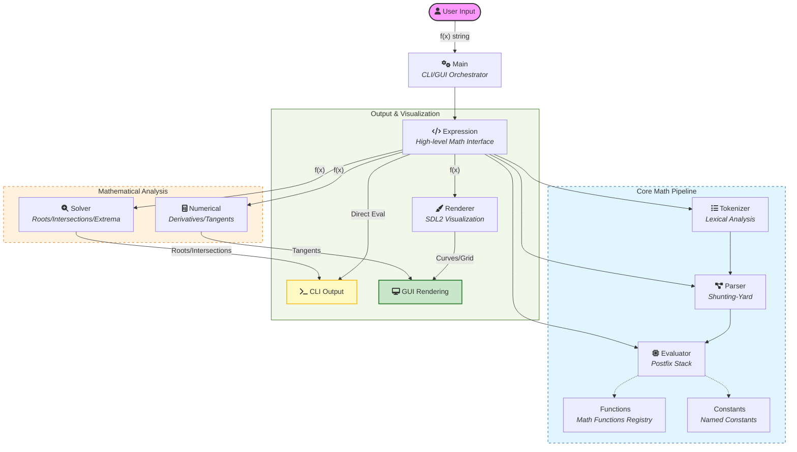

<p align="center">
  <h1 align="center">MathStudio</h1>
  <p align="center">
    A real-time mathematical function plotter with an interactive GUI and a powerful CLI.<br>
    Built from scratch in C++17 with SDL2. No external math libraries.
  </p>
</p>

<p align="center">
  
  
  
  
  
  <br>
  
  <a href="https://github.com/Bharat940/Simple-math-calculator-and-plotter/releases/tag/v0.1.0">
    
  </a>

  
</p>

---

## Features

### Interactive GUI
- **Real-time function plotting** with adaptive curve rendering for smooth visuals
- **Multi-function support** -- plot and compare multiple functions simultaneously with color-coded legends and a curated dark palette
- **Zoom and pan** -- mouse wheel zoom with keyboard panning (arrow keys)
- **Tangent line visualization** at the cursor position
- **Root and extrema markers with live coordinate text labels** -- toggle display of zeros, local min (yellow), local max (orange), and saddle points (gray) with `x=...` and `(x, y)` text callouts directly on canvas
- **Live coordinate tracking** -- see exact (x, y) values at the mouse cursor
- **Adaptive grid** with configurable scaling modes (auto / fixed / loose / dense)
- **Discontinuity detection** -- avoids drawing false connections at asymptotes (e.g. `tan(x)`), configurable via `--disc-threshold`
- **Resizable window** -- default `1280x720` resolution with full dynamic window scaling

### Command-Line Interface & Signal Math
- **Evaluate** expressions: `mathstudio -e "sin(tau/4)"`
- **Scientific Notation**: parsing for tiny or huge numbers directly (`1e-5`, `2.3e10`, `3E2`)
- **Signal Variables**: native support for `x` (standard), `t` (time domain for DSP/signals, e.g. `sin(2*pi*t)`), and `n` (discrete index)
- **Solve** equations (find roots): `mathstudio -s "x^2 - 4"`
- **Find intersections** of two functions: `mathstudio -i "x^2" "2*x + 1"`
- **Verbose mode** with Newton-Raphson convergence details

---

## Supported Math

| Category | Functions / Symbols |
|----------|---------------------|
| **Trigonometric** | `sin`, `cos`, `tan`, `asin`, `acos`, `atan` |
| **Hyperbolic** | `sinh`, `cosh`, `tanh` |
| **Exponential** | `exp`, `log` (natural), `log10`, `log(x, base)` |
| **Algebraic** | `sqrt`, `abs`, `floor`, `ceil`, `pow`, `max`, `min` |
| **Variables** | `x` (standard), `t` (time domain), `n` (discrete index) |
| **Constants** | `pi`, `e` (Euler's number), `phi` (Golden ratio), `tau` (`= 2*pi`) |
| **Operators** | `+`, `-`, `*`, `/`, `^` (power) |

**Smart parsing features:**
- Implicit multiplication: `2x`, `3sin(x)`, `(x+1)(x-1)`
- Scientific notation: `1.5e-3`, `2.3e10`, `3E2`
- Unary minus: `-x^2`, `sin(-x)`
- Nested functions: `sin(cos(x^2))`

---

## Building from Source

### Prerequisites

- **CMake** 3.10 or later
- **C++17** compatible compiler (GCC 7+, Clang 5+, MSVC 2017+)
- **SDL2** and **SDL2_ttf** development libraries

### Linux

```bash
# Install dependencies (Ubuntu / Debian)
sudo apt-get install cmake g++ libsdl2-dev libsdl2-ttf-dev

# Build
git clone https://github.com/Bharat940/Simple-math-calculator-and-plotter.git
cd Simple-math-calculator-and-plotter
mkdir build && cd build
cmake ..
make

./mathstudio "sin(x)"
```

### macOS

```bash
# Install dependencies via Homebrew
brew install cmake sdl2 sdl2_ttf

# Build
git clone https://github.com/Bharat940/Simple-math-calculator-and-plotter.git
cd Simple-math-calculator-and-plotter
mkdir build && cd build
cmake ..
make

./mathstudio "sin(x)"
```

### Windows

#### Option A: Interactive GUI Plotter (Visual Studio MSVC + vcpkg)
```powershell
# 1. Install dependencies via vcpkg
vcpkg install sdl2 sdl2-ttf --triplet x64-windows

# 2. Load Visual Studio environment & build with CMake
& "C:\Program Files\Microsoft Visual Studio\18\Community\Common7\Tools\Launch-VsDevShell.ps1" -Arch amd64
cmake -B build -DCMAKE_TOOLCHAIN_FILE="C:/Dev/vcpkg/scripts/buildsystems/vcpkg.cmake"
cmake --build build

# 3. Launch Interactive GUI Window
.\build\mathstudio.exe "sin(x), cos(x)"
```

#### Option B: Fast CLI Engine (MinGW GCC)
Builds `mathstudio.exe` in CLI evaluation & solver mode directly from any PowerShell prompt:

```powershell
cmake -B build -G "MinGW Makefiles" -DCMAKE_BUILD_TYPE=Release
cmake --build build

.\build\tests.exe
.\build\mathstudio.exe -e "sin(tau/4)"
```

---

## Usage

### GUI Mode

```bash
# Windows
.\build\mathstudio.exe "x^3 - 3*x"

# Linux / macOS
./build/mathstudio "sin(x), cos(x), tan(x)"

# Time-domain signal
./build/mathstudio "sin(tau*t)"
```

### CLI Mode

```bash
# Evaluate at x = 0 (uses tau = 2*pi)
.\build\mathstudio.exe -e "sin(tau/4)"
# Output: 1

# Scientific notation evaluation
.\build\mathstudio.exe -e "1.5e-3 * 2e3"
# Output: 3

# Find roots of f(x) = 0
.\build\mathstudio.exe -s "x^2 - 4"
# Output: -2 2

# Detailed solver output
./build/mathstudio -s "x^3 - x" --verbose

# Find intersections of f(x) = g(x)
.\build\mathstudio.exe -i "x^2" "2*x + 1"
# Output: -0.414214 2.41421
```

### All Options

| Option | Description | Default |
|--------|-------------|---------|
| `--range xmin xmax` | Set solving/plotting range | -100 to 100 |
| `--step value` | Solver step size | 0.1 |
| `--precision value` | Numeric precision | 1e-6 |
| `--zoom-step value` | Zoom sensitivity | 1.1 |
| `--zoom-min value` | Minimum view range | 0.01 |
| `--zoom-max value` | Maximum view range | 500 |
| `--scale mode` | Grid scaling: `auto` / `fixed` / `loose` / `dense` | auto |
| `--disc-threshold` | Asymptote discontinuity threshold | 10000 |
| `--font path` | Custom font file path | System default |
| `--verbose` | Detailed solver output | off |

---

## GUI Controls

| Key | Action |
|-----|--------|
| Mouse Wheel | Zoom in / out |
| Arrow Keys | Pan the viewport |
| T | Toggle tangent line at cursor |
| G | Toggle grid |
| R | Toggle roots (zeros) display & canvas text labels |
| E | Toggle extrema (min/max/saddle) display & canvas text labels |
| Tab | Cycle through active function |
| ESC | Quit |

---

## Troubleshooting & Common Build Issues

### 1. `Running 'nmake' failed / CMAKE_CXX_COMPILER not set` (Windows)
* **Why it happens**: Microsoft Visual Studio does not pollute the global Windows `%PATH%` environment variable with `cl.exe` and `nmake.exe` by default so multiple Visual Studio installations can coexist on the same PC.
* **Fix**: Run via **Developer PowerShell for VS**, or execute the VS environment script in PowerShell before `cmake`:
  ```powershell
  & "C:\Program Files\Microsoft Visual Studio\18\Community\Common7\Tools\Launch-VsDevShell.ps1" -Arch amd64
  ```

### 2. `CMake Error: Generator does not match generator used previously`
* **Why it happens**: You switched CMake generators (e.g. from `MinGW Makefiles` to `NMake` or `Visual Studio`) in an existing build directory.
* **Fix**: Clean the cached `build/` directory before re-configuring:
  ```powershell
  Remove-Item -Recurse -Force build -ErrorAction SilentlyContinue
  ```

### 3. `SDL.h not found` or SDL2 Link Errors
* **Why it happens**: Missing SDL2 development packages or mismatched compiler architecture (32-bit vs 64-bit).
* **Fix**:
  - **Linux**: `sudo apt-get install libsdl2-dev libsdl2-ttf-dev`
  - **macOS**: `brew install sdl2 sdl2_ttf`
  - **Windows**: `vcpkg install sdl2 sdl2-ttf --triplet x64-windows` and pass `-DCMAKE_TOOLCHAIN_FILE="<path-to-vcpkg>/scripts/buildsystems/vcpkg.cmake"`.

### 4. Binary compiles in CLI mode instead of GUI mode
* **Why it happens**: CMake could not find SDL2 libraries for your active compiler, so it built `mathstudio` with `-DNO_SDL` CLI fallback so math evaluation, solver, tests, and benchmarks still run cleanly.
* **Fix**: Ensure SDL2 dev libraries match your compiler architecture (e.g. `x64-windows` for Visual Studio MSVC).

---

## Architecture

The project follows a modular pipeline design:


```mermaid
graph TD
    %% Node Definitions
    User([fa:fa-user User Input])
    Main[fa:fa-cogs Main<br/><i>CLI/GUI Orchestrator</i>]
    Expr[fa:fa-code Expression<br/><i>High-level Math Interface</i>]
    Token[fa:fa-list Tokenizer<br/><i>Lexical Analysis</i>]
    Parse[fa:fa-project-diagram Parser<br/><i>Shunting-Yard</i>]
    Eval[fa:fa-microchip Evaluator<br/><i>Postfix Stack</i>]
    Funcs[fa:fa-function Functions<br/><i>Math Functions Registry</i>]
    Consts[fa:fa-pi Constants<br/><i>Named Constants</i>]
    
    Solve[fa:fa-search-plus Solver<br/><i>Roots/Intersections/Extrema</i>]
    Num[fa:fa-calculator Numerical<br/><i>Derivatives/Tangents</i>]
    Render[fa:fa-paint-brush Renderer<br/><i>SDL2 Visualization</i>]

    %% Core Pipeline
    User -- "f(x) string" --> Main
    Main --> Expr
    Expr --> Token
    Expr --> Parse
    Expr --> Eval
    
    %% Analysis Modules
    Expr -- "f(x)" --> Solve
    Expr -- "f(x)" --> Num
    Expr -- "f(x)" --> Render
    
    subgraph CoreMath [Core Math Pipeline]
        direction LR
        Token --> Parse --> Eval
        Eval -.-> Funcs
        Eval -.-> Consts
    end

    subgraph Analysis [Mathematical Analysis]
        direction TB
        Solve
        Num
    end

    subgraph Output [Output & Visualization]
        direction TB
        Solve -- "Roots/Intersections" --> CLI[fa:fa-terminal CLI Output]
        Num -- "Tangents" --> GUI[fa:fa-desktop GUI Rendering]
        Render -- "Curves/Grid" --> GUI
        Expr -- "Direct Eval" --> CLI
    end

    %% Styling
    style User fill:#f9f,stroke:#333,stroke-width:2px
    style CoreMath fill:#e1f5fe,stroke:#01579b,stroke-dasharray: 5 5
    style Analysis fill:#fff3e0,stroke:#ef6c00,stroke-dasharray: 5 5
    style Output fill:#f1f8e9,stroke:#33691e
    style GUI fill:#c8e6c9,stroke:#2e7d32,stroke-width:2px
    style CLI fill:#fff9c4,stroke:#fbc02d,stroke-width:2px
```

### Module Breakdown

| Module | File(s) | Description |
|--------|---------|-------------|
| **Main** | `main.cpp` | Entry point: CLI argument parsing, mode dispatch (-e/-s/-i/GUI), SDL2 GUI event loop |
| **Expression** | `expression.h/cpp` | High-level math expression interface: tokenizes, parses, validates, and evaluates expressions |
| **Tokenizer** | `tokenizer.h/cpp` | Lexical analysis: converts expression strings to tokens with implicit multiplication and scientific notation support |
| **Parser** | `parser.h/cpp` | Shunting-Yard algorithm: converts infix token stream to postfix notation |
| **Evaluator** | `evaluator.h/cpp` | Stack-based postfix evaluation engine with function, constant, and variable lookups |
| **Functions** | `functions.h/cpp` | Registry of 18 built-in math functions (sin, cos, log, etc.) with domain validation |
| **Constants** | `constants_registry.h/cpp` | Named constant registry (pi, e, phi, tau) for symbolic math |
| **Solver** | `solver.h/cpp` | Root-finding and detailed extrema classification (minima, maxima, saddle points) |
| **Numerical** | `numerical.h/cpp` | Numerical differentiation using central differences and tangent line computation |
| **Renderer** | `renderer.h/cpp` | SDL2 rendering engine: adaptive curve plotting, grid, dark palette, text labels, markers |

### Key Algorithms

- **Adaptive Curve Rendering**: Recursive subdivision based on screen-space error. Produces smooth curves with fewer samples where the function is linear, and more detail at curves and inflection points.
- **Discontinuity Detection**: Slope-threshold check to avoid connecting asymptotes (e.g., `tan(x)` near pi/2).
- **Hybrid Root Finding**: Bisection method for robustness, followed by Newton-Raphson for precision refinement.
- **Extrema Classification**: Second numerical derivative check to categorize points into local minima, local maxima, and saddle points.
- **Nice Number Grid Scaling**: Grid lines snap to "nice" intervals (1, 2, 5 x 10^n) for readable axis labels.

---

## Project Structure

```
Simple-math-calculator-and-plotter/
|-- CMakeLists.txt              # Cross-platform build configuration
|-- LICENSE                     # MIT License
|-- README.md
|-- CHANGELOG.md                # Release tracks
|-- ROADMAP.md                  # Phase roadmap
|-- CONTRIBUTING.md             # Guidelines for contributors
|-- .gitignore
|-- .github/
|   +-- workflows/
|       +-- build.yml           # CI/CD -- build and test on Linux, macOS, Windows
|-- benchmarks/
|   +-- bench_v1.cpp            # Performance benchmark suite
|-- tests/
|   +-- test_math.cpp           # 132 Unit tests for the math pipeline
+-- src/
    |-- main.cpp                # Entry point, CLI parsing, GUI event loop
    |-- renderer.h/cpp          # SDL2 rendering engine
    +-- math/
        |-- tokenizer.h/cpp             # Lexical analysis
        |-- parser.h/cpp                # Shunting-Yard parser
        |-- evaluator.h/cpp             # Postfix evaluator
        |-- expression.h/cpp            # Expression wrapper
        |-- functions.h/cpp             # Function registry
        |-- solver.h/cpp                # Root, intersection & extrema finding
        |-- numerical.h/cpp             # Derivatives and tangents
        |-- constants.h                 # Numeric epsilon constants
        |-- constants_registry.h/cpp    # Named constants (pi, e, phi, tau)
        |-- result.h                    # EvalResult type
        +-- geometry.h                  # Line struct (slope + intercept)
```

---

## Examples

```bash
# Polynomial curves
./mathstudio "x^2, x^3, x^4"

# Trigonometric comparison
./mathstudio "sin(x), cos(x)"

# Time-domain signal processing
./mathstudio "sin(tau*t)"

# Damped oscillation
./mathstudio "exp(-x^2) * sin(10*x)"

# Gaussian curve
./mathstudio "exp(-x^2)"

# Combined expression
./mathstudio "sin(x^2) + cos(x^3)"

# Root finding with details
./mathstudio -s "x^3 - 6*x^2 + 11*x - 6" --verbose
```

---

## Testing & Performance Benchmarks

The project includes a self-contained unit test suite (132 tests) and a performance benchmark suite.

```bash
# Build and run tests
mkdir build && cd build
cmake ..
cmake --build .

# Linux / macOS
./tests
./benchmarks

# Windows
.\build\tests.exe
.\build\benchmarks.exe
```

### What is Tested (132/132 Tests Passing)

| Suite | Coverage |
|-------|----------|
| Tokenizer | Number/variable/operator/function/constant tokens, implicit multiplication, scientific notation, invalid characters |
| Parser | Postfix conversion, operator precedence, associativity, parentheses, unary minus, mismatched parens |
| Evaluator | Arithmetic, variable substitution (`x`, `t`, `n`), division by zero, order of operations |
| Functions | All 18 built-in functions, domain error detection (`asin`, `sqrt`, `log`), binary functions (`pow`, `max`, `min`, `log` with base) |
| Constants | `pi`, `e`, `phi`, `tau` (`= 2*pi`) values and usage in expressions |
| Expression | Complex expressions, `sin^2+cos^2` identity, nested functions, `evalSafe` |
| Numerical | Derivatives of `x^2`, `sin(x)`, `x^3` at specific points, tangent line computation |
| Solver | Root-finding (`x^2-4`, `sin(x)`, `x^3`), detailed results, intersections, extrema classification |
| Edge Cases | Empty expressions, large exponents, negative exponents, scientific notation (`1e-5`), deep nesting |

### Benchmark Metrics Baseline (v0.1.0 Foundation Release)

System: MSVC 19.51 (`Launch-VsDevShell.ps1 -Arch amd64`), Windows x64.

| Benchmark | Iterations | Average Time (ms/run) | Unit Time |
|-----------|------------|-----------------------|-----------|
| **Parse 1,000 expressions** | 1,000 expressions | **96.08 ms** | ~96.08 μs / expr |
| **Evaluate 100,000 points** | 100,000 points | **1,329.58 ms** | ~13.29 μs / point |
| **Find roots `sin(x)`** | Range `[-50, 50]` | **7.33 ms** | ~0.14 ms / root |
| **Find extrema `x^3 - 3x`** | Range `[-5, 5]` | **1.68 ms** | ~0.84 ms / extremum |

Detailed historical benchmarks are logged in [`benchmarks/benchmark_v0.1.0.md`](benchmarks/benchmark_v0.1.0.md).


---

## Project Roadmap & Versioning Strategy

MathStudio follows a strict **Semantic Versioning** progression model. Full architectural details and module timelines are documented in [`ROADMAP.md`](ROADMAP.md).

```text
v0.0.1  ✅  Prototype Release — initial RPN evaluator & basic plotter
  ↓
v0.1.0  ✅  Foundation Release (Current) — bug fixes, refactoring, 132 tests, benchmarks, dark titlebar
  ↓
v0.2.0  📋  Architecture Rewrite — AST + visitors + MathValue + Dear ImGui UI
  ↓
v0.3.0  📋  Calculus Engine — symbolic diff, integration, limits, Taylor series
  ↓
v0.4.0  📋  Signal Processing — FFT, DFT, IFFT, convolution, filter visualizer
  ↓
v0.5.0  📋  Linear Algebra — Matrix & vector editor, eigenvalues
  ↓
v0.6.0  📋  Computer Algebra System — Symbolic simplification, factoring
  ↓
v1.0.0  🎯  Stable Scientific Computing Engine Major Milestone
```

---

## Technical Highlights


- **Zero external math dependencies** -- all parsing, evaluation, and numerical methods implemented from scratch
- **Cross-platform** -- builds and runs on Linux, macOS, and Windows with a single CMakeLists.txt
- **CI/CD** -- automated build and test on three platforms via GitHub Actions
- **132 Unit tests passing** -- comprehensive test suite covering all math modules
- **Extrema Classification** -- classifies local minima, maxima, and saddle points using numerical second derivatives
- **Canvas Text Labels** -- renders formatted coordinate callouts directly on graph markers
- **Safe evaluation** — `EvalResult` pattern provides structured error handling without exceptions in hot paths
- **Domain-aware functions** — `sqrt`, `log`, `asin`, `acos`, and `tan` return clear error messages for out-of-domain inputs
- **Cross-platform font loading** — automatic fallback chain across Linux, macOS, and Windows font paths
- **Input validation** — character whitelisting, parenthesis balancing, and nesting depth limits

---

## Download & Releases

The latest compiled binaries for Windows, Linux, and macOS are available in the [Releases](https://github.com/Bharat940/Simple-math-calculator-and-plotter/releases/tag/v0.1.0) section.


---

## Contributing

Contributions are welcome! Whether you're fixing a bug, suggesting a feature, or improving documentation, here's how you can help:

1.  **Fork** the repository.
2.  Create a **feature branch** (`git checkout -b feature/AmazingFeature`).
3.  **Commit** your changes (`git commit -m 'Add AmazingFeature'`).
4.  **Push** to the branch (`git push origin feature/AmazingFeature`).
5.  Open a **Pull Request**.

---

## License

This project is licensed under the [MIT License](LICENSE).

---

## Author

**Bharat Dangi**  
📧 [bdangi450@gmail.com](mailto:bdangi450@gmail.com)  
🔗 [github.com/Bharat940](https://github.com/Bharat940)