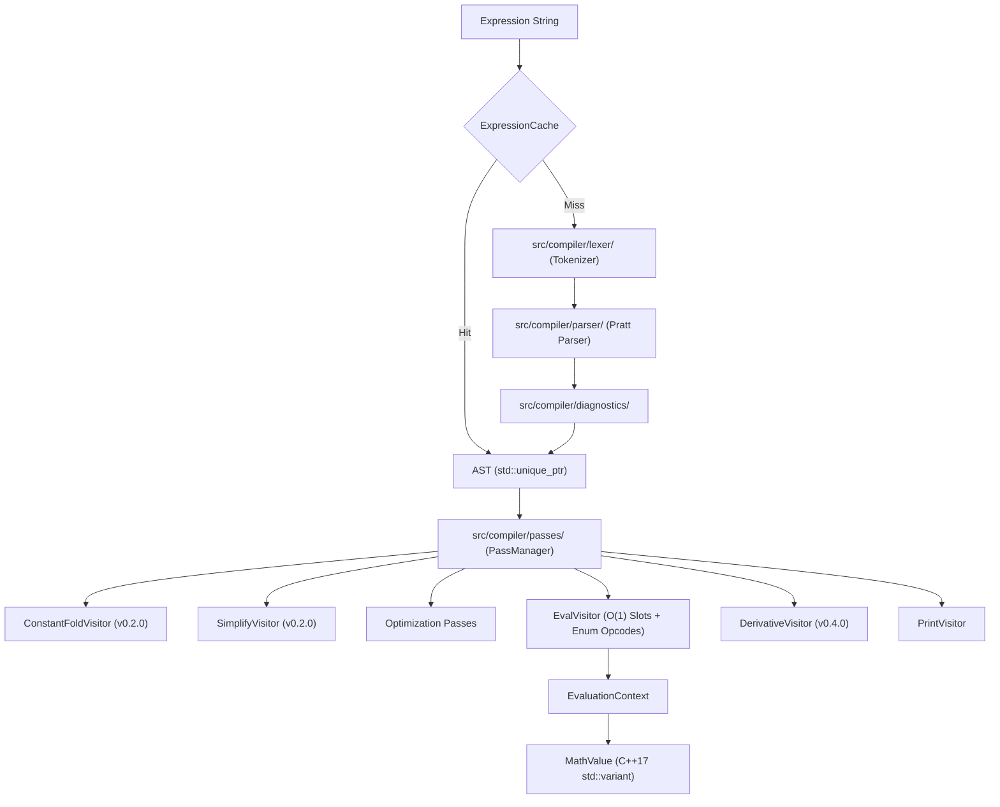

# MathStudio Master Architecture Roadmap (v0.1.0 → v1.0.0)

**Project Goal**: Evolving MathStudio from a simple function plotter into a modern, lightweight, high-performance **scientific computing engine** — combining the interactive visualization of Desmos with the symbolic capabilities of MATLAB / SymPy and the parsing elegance of modern compiler frontends.

---

## 1. Core Architecture Pipeline

The central representation of expressions in MathStudio is a **pure Abstract Syntax Tree (AST)** driven by a Pratt Parser. The legacy RPN postfix interpreter has been deprecated into `legacy/` and replaced by a pure compiler pipeline:

---

## 2. Master Version Track & Milestones

```mermaid
graph TD
    v010["v0.1.0 Foundation Release (Complete)<br/>• Refactored C++17 Pipeline<br/>• 132 Unit Tests & Benchmark Suite<br/>• Native Windows Dark Titlebar<br/>• Extrema Canvas Labels & Signal Variables (t, n)"] --> v020

    v020["v0.2.0 AST Engine Architecture (Complete & Frozen)<br/>• Compiler Substructure (src/compiler/)<br/>• Pratt Parser Engine (Binding-Power Operator Table)<br/>• MathValue C++17 std::variant (double, complex, Matrix, Vector, bool)<br/>• EvaluationContext (Vars, Functions, Diagnostics)<br/>• Visitor Substrate (EvalVisitor, PrintVisitor)<br/>• PassManager Passes (ConstantFoldVisitor, SimplifyVisitor)<br/>• O(1) Variable Slots & Enum Opcodes (BinaryOpType, UnaryOpType)<br/>• ExpressionCache & Deprecate RPN to legacy/"] --> v030

    v030["v0.3.0 Dear ImGui & ImPlot UI Overhaul (Next)<br/>• Dear ImGui (Docking Branch) Integration<br/>• ImPlot Signal & Performance Visualizers<br/>• Interactive Control Panels & Variable Inspectors"] --> v040

    v040["v0.4.0 Calculus Engine<br/>• Symbolic Differentiation (DerivativeVisitor)<br/>• Numerical Integration (Simpson's 3/8, Adaptive Quadrature)<br/>• Limits & Taylor Series Expansion"] --> v050

    v050["v0.5.0 Linear Algebra Engine<br/>• Typed Matrix Operations (Matrix<T>)<br/>• Determinants, Inverses, Eigenvalues"] --> v060

    v060["v0.6.0 Signal Processing (DSP)<br/>• DFT → FFT → IFFT → Discrete Convolution Engine<br/>• Correlation, Window Functions (Hann, Hamming, Blackman)<br/>• Spectrogram & Dual-Domain Canvas"] --> v070

    v070["v0.7.0 Computer Algebra System (CAS)<br/>• Full CAS Symbolic Engine<br/>• Polynomial Expansion & Factoring"] --> v080

    v080["v0.8.0 Sessions & Project Serialization<br/>• AST Serialization to JSON<br/>• Multi-Level Undo / Redo & Session State Manager"] --> v100

    v100["v1.0.0 ★ Stable Scientific Computing Engine<br/>• Production Hardened Release"]

    style v010 fill:#e1f5fe,stroke:#01579b
    style v020 fill:#e8f5e9,stroke:#2e7d32,stroke-width:2px
    style v030 fill:#fff3e0,stroke:#ef6c00,stroke-width:2px
    style v040 fill:#f3e5f5,stroke:#7b1fa2
    style v100 fill:#fff9c4,stroke:#fbc02d,stroke-width:2px
```

---

## 3. Version Specifications

| Version | Focus | Status | Key Deliverables & Architectural Specs |
|---------|-------|--------|---------------------------------------|
| **v0.1.0** | Foundation | ✅ Complete | C++17 refactoring, 132 unit tests, benchmark baseline, dark titlebar, coordinate labels |
| **v0.2.0** | AST Engine Architecture | ✅ Complete & Frozen | `src/compiler/`, Pratt parser, `std::variant<MathValue>`, `EvaluationContext`, `ExpressionCache`, `ConstantFoldVisitor`, `SimplifyVisitor`, $O(1)$ variable slots, `BinaryOpType`/`UnaryOpType` enums |
| **v0.3.0** | ImGui & ImPlot UI Overhaul | 📋 Next | Dear ImGui docking UI, ImPlot signal & performance charts, docked variable inspectors |
| **v0.4.0** | Calculus Engine | 📋 Planned | Symbolic differentiation (`DerivativeVisitor`), numerical integration (Simpson's 3/8, Adaptive Quadrature), Taylor series |
| **v0.5.0** | Linear Algebra | 📋 Planned | Matrix & Vector AST nodes, typed `Matrix<T>`, Gaussian elimination, determinants, eigenvalues |
| **v0.6.0** | DSP & Signals | 📋 Planned | DFT, FFT, IFFT, discrete convolution, correlation, window functions, spectrogram visualization |
| **v0.7.0** | CAS Engine | 📋 Planned | Symbolic computer algebra system, polynomial expansion, factoring, symbolic simplification |
| **v0.8.0** | Sessions & Serialization | 📋 Planned | AST JSON serialization, workspace project files, undo/redo manager |
| **v1.0.0** | Major Milestone | 🎯 Goal | **Stable Scientific Computing Engine** |

---

## 4. Architectural Module Structure

| Module Layer | Location | Key Responsibilities |
|--------------|----------|----------------------|
| **Core Storage** | `src/core/` | C++17 `std::variant<MathValue>`, `VariableStore`, `FunctionRegistry`, `EvaluationContext`, `ExpressionCache` |
| **Compiler Substructure** | `src/compiler/` | Pratt Parser (`PrattParser.hpp`), AST Tree (`Node.hpp` with `unique_ptr`), Visitors (`EvalVisitor`, `PrintVisitor`), Passes (`PassManager`, `ConstantFoldVisitor`), Diagnostics (`Diagnostics.hpp`) |
| **Math Pipeline** | `src/math/` | High-level `Expression` wrapper, `tokenizer`, `solver` (Newton-Raphson/Bisection), `numerical` (derivatives/tangents), `constants_registry` |
| **Legacy RPN** | `legacy/` | Historical `shunting_yard.h/cpp` reference (marked `[[deprecated]]`) |
| **UI & Renderer** | `src/ui/` & `src/renderer` | SDL2 canvas plotter, Dear ImGui control panels, ImPlot visualizers, Obsidian dark theme |

---

## 5. Performance Engineering Strategy

1. **Pratt Parser Efficiency**: Eliminates operator stack shuffling, yielding **~4.1x faster uncached parsing** (23.33 ms vs 96.08 ms).
2. **ExpressionCache Zero-Overhead**: Eliminates re-parsing on render loops (0.00 ms re-parse overhead).
3. **AST as the Enabler for Passes**: The AST enables `ConstantFoldVisitor` (`2*pi*x -> 6.283185*x`), `SimplifyVisitor` (`x*1 -> x`), $O(1)$ variable array indexing, and AST arena memory allocation.
