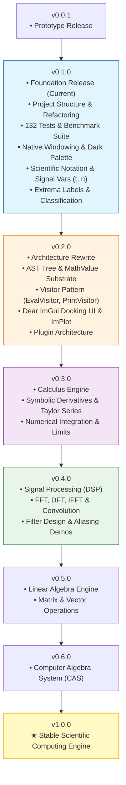

# MathStudio Roadmap

## Release Progression Strategy

---

## Version Tracker Table

| Version | Focus | Status | Description |
|---------|-------|--------|-------------|
| **v0.0.1** | Prototype | ✅ Released | Initial proof-of-concept plotter with RPN evaluator |
| **v0.1.0** | Foundation | ✅ Complete | Refactored architecture, 132 unit tests, benchmark suite, native dark titlebar, extrema labels, scientific notation |
| **v0.2.0** | Architecture Rewrite | 📋 Planned | AST tree hierarchy, MathValue type system, Visitor pattern, Dear ImGui docking UI |
| **v0.3.0** | Calculus | 📋 Planned | Symbolic differentiation, numerical integration, limits, Taylor series |
| **v0.4.0** | Signal Processing | 📋 Planned | FFT, DFT, IFFT, convolution, filter response visualizer |
| **v0.5.0** | Linear Algebra | 📋 Planned | Matrix & vector editor, determinants, eigenvalues |
| **v0.6.0** | Computer Algebra | 📋 Planned | CAS expansion, symbolic simplification, expression factoring |
| **v1.0.0** | Major Milestone | 🎯 Goal | **Stable Scientific Computing Engine** |

---

## Guiding Principles

1. **Semantic Versioning Integrity**: `v0.1.0` establishes the stable foundation. Major `v1.0.0` is earned when the full AST + ImGui + Calculus + DSP suite is complete.
2. **Measurable Performance Progress**: Every release tracks performance metrics against baseline benchmarks.
3. **Architecture Discipline**: No new domain features until the `v0.2.0` AST + MathValue substrate is locked.
