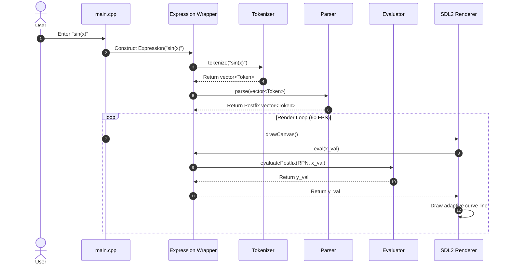
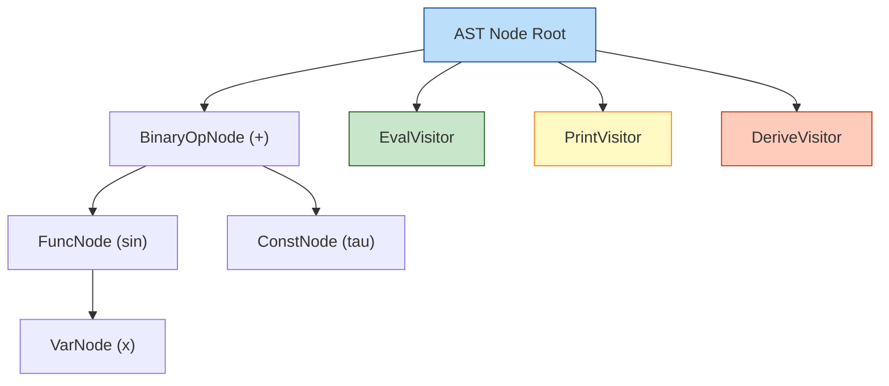

# MathStudio Architecture (v1.x)

## Architectural Overview

```mermaid
flowchart TD
    subgraph Input [Expression Entry]
        Str["Expression String<br/><i>e.g. sin(2*pi*t)</i>"]
    end

    subgraph Lexical [Lexical Phase]
        Str --> Tok[Tokenizer]
        Tok --> |Flat Token Stream| Tokens[Token Vector]
    end

    subgraph Parsing [Parsing Phase]
        Tokens --> Parse[Shunting-Yard Parser]
        Parse --> |Infix to Postfix| RPN[Postfix RPN Tokens]
    end

    subgraph Execution [Evaluation Engine]
        RPN --> Eval[Postfix Stack Evaluator]
        Eval --> |f(x) value| Result[Numeric Result / EvalResult]
    end

    subgraph Subsystems [Downstream Processing]
        Result --> Solver[Root & Extrema Solver]
        Result --> Derivative[Central Difference Derivative]
        Result --> Renderer[SDL2 Graph Renderer]
    end

    style Input fill:#e1f5fe,stroke:#01579b
    style Lexical fill:#fff3e0,stroke:#ef6c00
    style Parsing fill:#f3e5f5,stroke:#7b1fa2
    style Execution fill:#e8f5e9,stroke:#2e7d32
    style Subsystems fill:#fbe9e7,stroke:#c62828
```

---

## Evaluation Sequence Diagram



---

## Module Responsibilities

- **`src/math/tokenizer.cpp`**: Performs lexical analysis, handles implicit multiplication insertion (`2x` → `2*x`), numbers, variables (`x`, `t`, `n`), scientific notation (`1e-5`), and constants lookup (`pi`, `e`, `phi`, `tau`).
- **`src/math/parser.cpp`**: Implements Dijkstra's Shunting-Yard algorithm to parse infix tokens into Reverse Polish Notation (RPN).
- **`src/math/evaluator.cpp`**: Stack-based evaluation of RPN tokens for any value of the variable.
- **`src/math/solver.cpp`**: Numerical algorithms (Bisection + Newton-Raphson) for root finding, intersection calculation, and numerical extrema detection.
- **`src/renderer.cpp`**: Real-time SDL2 graph renderer with adaptive curve sampling, zoom/pan, dark-mode color palette, and text label overlays.

---

## Transition to v2.0 Architecture

In **v2.0**, the flat RPN vector pipeline is replaced with a formal **Abstract Syntax Tree (AST)** and a **Visitor Pattern** pipeline:


